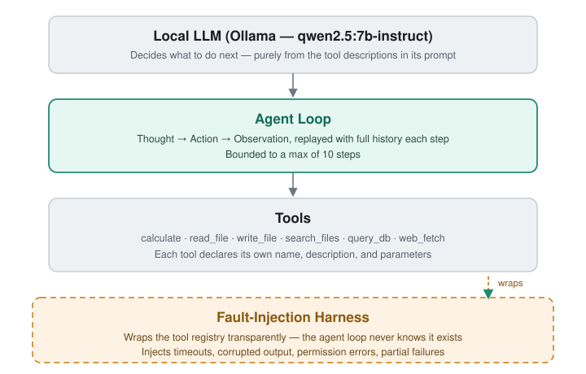

# Agentic Task Runner

A ReAct (Reason + Act) agent built from scratch, running on a local LLM, plus a harness that breaks its tools on purpose to see how well it recovers.

## What this is

Agent demos usually show the happy path: the model calls a tool, gets a clean result, answers. This project builds that loop from scratch — Thought, Action, Observation, repeated until the task is done or a step limit is hit — and then adds a second piece: a harness that injects failures into the tools (timeouts, bad output, permission errors, partial results) and measures what the agent actually does when that happens.

It runs fully locally on Ollama, no API keys needed.

## Demo

[](https://youtu.be/MU8fG9-7uEw)

A 2-minute walkthrough: the agent solving a multi-tool task, and what it does when the harness breaks a tool mid-run.

## Architecture



The agent has no idea the harness exists. Faults get injected by wrapping the tools underneath it, so the agent's own code never changes — only what its tools return.

## Results

Running the evaluation suite at increasing fault rates:

| Profile | Fault rate | Task success | Tool-error recovery |
|---|---|---|---|
| clean | 0% | 71% | 47% |
| light | 10% | 71% | 47% |
| heavy | 30% | 54% | 22% |

At a 10% fault rate the agent absorbs the failures completely — success stays flat, because it already retries and reads the error message before deciding what to do next. At 30% that stops working: success drops and its recovery rate halves. That's the number this project exists to produce — how much tool failure this agent can take before it starts breaking.

Full metrics and per-task recovery examples are generated by `generate_report.py` into `RELIABILITY_REPORT.md`.

## Tools

| Tool | What it does |
|---|---|
| `calculate` | Evaluates a math expression |
| `read_file` / `write_file` | Reads or writes a text file inside a sandboxed folder |
| `search_files` | Searches text files in that same sandboxed folder |
| `query_db` | Runs read-only SQL queries against a SQLite database |
| `read_document` | Reads text out of a PDF, Word, or Excel file |

## Installation

### Run with Docker

```bash
docker build -t agentic-task-runner .
docker run --rm agentic-task-runner
```

Builds the image and runs the test suite inside it. No Python setup needed on your machine.

### Run locally

Needs Python 3.11 and Ollama running with `qwen2.5:7b-instruct` pulled.

```bash
pip install -r requirements.txt
pip install -e .
pytest
```

Talk to the agent directly:

```bash
python chat.py
```

Run one task and see every step it took:

```bash
python try_agent.py "Read sales_report.txt and tell me the total for Q1."
```

Run the fault-injection harness:

```bash
python run_harness.py clean   # or: light, heavy, chaos
python generate_report.py
```

## Project structure

```
src/agent/      the ReAct loop, prompt, response parsing, task definitions
src/tools/      calculator, file I/O, document reader, search, SQLite query
src/harness/    fault injector, fault profiles, runner, evaluator, report generator
src/llm/        Ollama client wrapper
tasks/          evaluation suite (task_suite.json) + fixtures
tests/          unit tests, all mock-based, no live model needed
```

## Known limitations

- The model is small (7B) and runs locally, so multi-step reasoning and arithmetic sometimes fail. That's expected, and it's what the harness is there to measure.
- The agent loop stops after 10 steps. A task that needs more than that just fails.
- Tests run fully on mocks and don't need Ollama installed. Anything that talks to the real model (`try_agent.py`, `chat.py`, `run_harness.py`) needs Ollama running.
